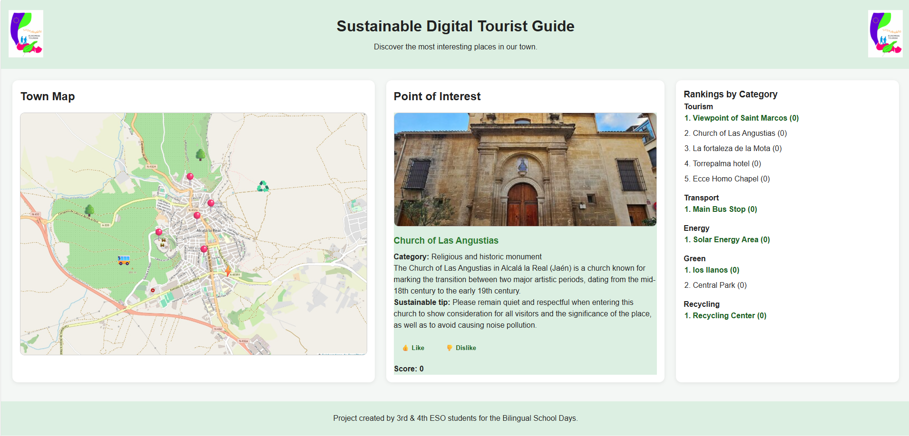

# Sustainable Digital Tourist Guide

Educational web project developed with 3rd year secondary students in the subject **Computing and Robotics** as part of the Bilingual School Days.

The project consists of an interactive web application that promotes sustainable tourism through a digital guide of the local area.

## Project Overview

Students created a digital tourist guide using a map with different Points of Interest (POIs). Each POI includes information in English, a sustainable recommendation and a voting system that allows users to rate the places.

The application also includes categorized points of interest, visual icons, color-coded categories and rankings by type.

## Live Demo

[Open the app](https://nespapu.github.io/sustainable-digital-tourist-guide/)

## Screenshot

## Main Features

* Interactive map with clickable Points of Interest
* Descriptions written in English
* Sustainable tips for each place
* Like and dislike voting system
* Local ranking system using browser storage
* Different POI categories:

  * Tourism
  * Transport
  * Energy
  * Green areas
  * Recycling points
* Category icons and visual styles
* iPad-friendly web app design

## Educational Goals

This project allowed students to:

* Apply basic web development skills
* Work with HTML, CSS and JavaScript
* Use English in a real communicative context
* Reflect on sustainable tourism
* Connect technology with their local environment
* Collaborate in a shared digital product

## Technologies Used

* HTML5
* CSS3
* JavaScript
* LocalStorage
* GitHub Pages

## How It Works

Users can click on the different icons displayed on the map. Each icon opens a card with information about the selected place.

Users can also vote for each POI using the like and dislike buttons. The votes are stored locally in the browser and used to generate rankings.

## Deployment

The project is deployed using GitHub Pages and can be opened as a web app on iPad from Safari.

## Educational Impact

The project combines digital competence, English communication skills and environmental awareness through a real-world software product created by students.

By contributing content to a shared application, students experienced how technology can be used to promote local culture and sustainable tourism.

## Notes

This project was designed as an educational activity. The technical structure was prepared by the teacher so that students could focus on content creation, English communication and sustainable tourism awareness.

## Acknowledgements

Special thanks to the students who participated in the project and to the teaching staff involved in the Bilingual School Days.

IES Antonio de Mendoza:
https://www.iesantoniodemendoza.com

## License

This project is licensed under the MIT License.
